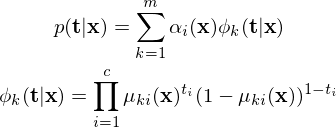
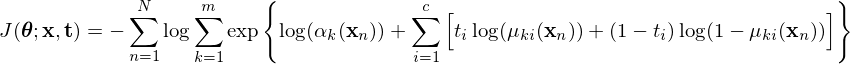
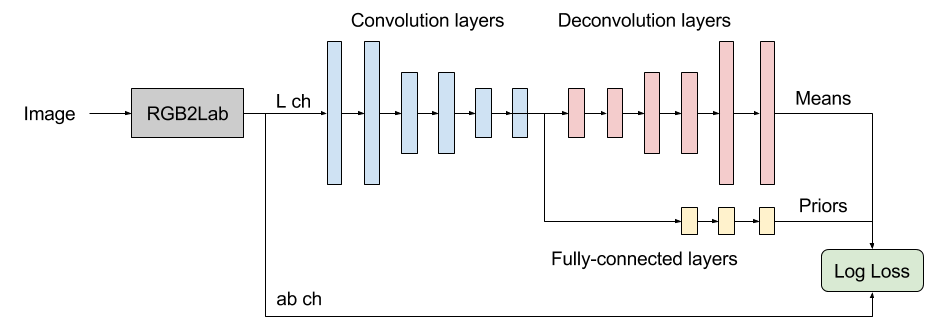

# Image colorization with Multivariate Bernoulli Mixture Density Network.

#### Note
* This is still work in progress.

## Description
This repository contains an implementation (currently under development) of Multivariate Bernoulli Mixture Density Network for colorization of grayscale images.

In a colorization task, for a given input grayscale image, there exist many possible colors that the objects in the image can take (for example, an apple could be either red or green), and thus the conditional probability of the colors given the input image is better represented by a mixture of densities that can handle multiple modes.

In order to handle the multiple modes in color space, there exist approaches in the literature that categorize the color space and cast the colorization class as a classification problem ([Zhang et al. 2016](https://arxiv.org/abs/1603.08511)), or avoid defining the conditional probability altogether by adopting and adversarial loss ([Cao et al. 2017](https://arxiv.org/pdf/1702.06674.pdf)).

This implementation attempts yet another way of performing colorization, this time by modelling directly the multimodal conditional distribution of color in ab space with a mixture of multivariate Bernoulli distributions. The Bernoulli distribution is used because the pixel color values must be between 0 and 1.

### Multivariate Bernoulli Mixture Density Network
The MBM is defined as in the equation below. Although the dimensions within each of the components are assumed to be statistically independent, the mixture as whole can model dependencies if given enough components ([Juan et al. 2004](http://citeseerx.ist.psu.edu/viewdoc/download?doi=10.1.1.183.5410&rep=rep1&type=pdf)). The network models the parameters **alpha** (priors) and **mu** (means) that characterize the mixture. Both **alpha** and **mu** are functions of the input grayscale image **x** and the networks parameters **theta**.

### Loss function
The network is trained to minimize the negative log-likelihood of the MBM defined as below:

### Network overview

### Dataset
* [ImageNet dataset](http://www.image-net.org/challenges/LSVRC/2012/nonpub-downloads)

## Repository info
### Files
* illustrations: Files of the images displayed in this README.
* mbmcolor: Modules necessary to build and train the model.
* scripts: Scripts for training the model and predicting with it.

### Requirements
* tensorflow-gpu==1.2.1
* Keras==2.0.8
* numpy==1.13.1
* skimage==0.13.0
